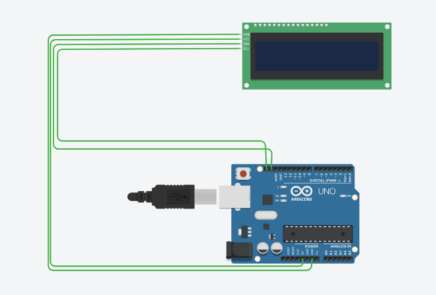

<h1 align="center">💬 Arduino LCD Kaydırmalı Mesaj Projesi</h1>

  
  
  
  

  Bu proje, <b>Arduino</b> ve <b>20x4 LCD ekran</b> kullanılarak kaydırmalı mesaj göstermeyi sağlar.  
  LCD üzerinde istediğiniz mesaj kayarak görünür ve mesajın sonuna kadar kayma efekti devam eder.  

---

## 🧠 Özellikler
- LCD ekran üzerinde kaydırmalı mesaj gösterir  
- Mesaj uzunluğu LCD karakter sayısından fazla olsa bile kayma efekti ile görünür  
- Mesaj hızını `delay()` ile kolayca ayarlayabilirsiniz  
- Konsol veya bilgisayar gerekmeden Arduino ve LCD ile bağımsız çalışır  

---

## ⚙️ Kullanılan Donanımlar
- 🔸 Arduino Uno  
- 🔸 20x4 I2C LCD Ekran  
- 🔸 Dirençler ve jumper kablolar  

---

## 🔌 Bağlantılar
- LCD SDA → Arduino A4  
- LCD SCL → Arduino A5  
- LCD VCC → 5V  
- LCD GND → GND  

> LCD adresi kodda `0x27` olarak ayarlanmıştır. Farklı LCD kullanıyorsanız adresi değiştirin.  

---

## 🧰 Kullanım
1. Donanım bağlantılarını yukarıdaki tabloya göre yapın  
2. Arduino IDE’de kodu yükleyin  
3. LCD üzerinde mesaj kayarak görünmeye başlayacaktır  
4. `message` değişkeni ile mesaj içeriğini değiştirebilirsiniz  

---

## 🖼️ Devre Görseli

  

> Not: Eğer servo motor veya başka bileşen eklenmediyse, devrede sadece LCD gözükür.  

---

## 📜 Lisans
Bu proje açık kaynaklıdır.  
Dilersen geliştirebilir ve kendi projelerinde kullanabilirsin.  

---

<h3 align="center">👨‍💻 Geliştirici</h3>

  <b>Yavuz Candır</b>  
   
  

